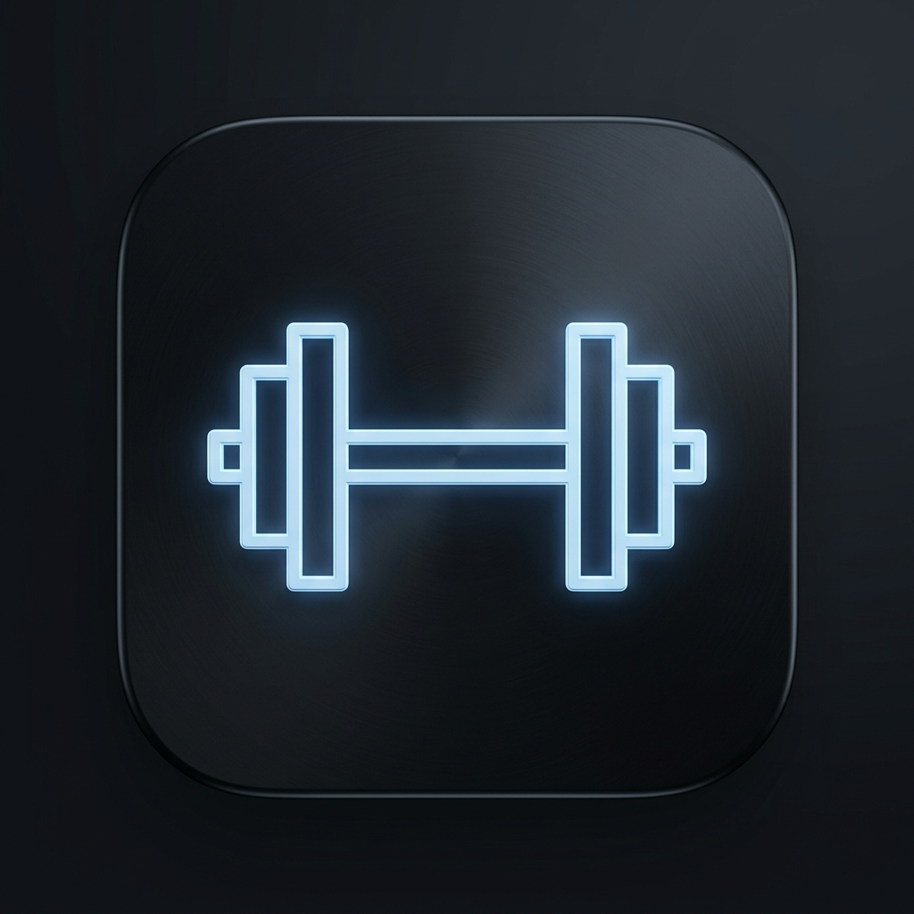

<div align="center">

  

  # Get Fit

  **The Zero-Fluff, Local-First iOS Workout & Progressive Overload Tracker**

  [](https://apple.com)
  [](https://swift.org)
  [](https://developer.apple.com/xcode/swiftdata/)
  [](https://developer.apple.com/activitykit/)
  [](#license)

  *Built out of pure frustration with bloated gym apps filled with ads, paywalls, and mandatory account signups.*

</div>

---

## 🎯 Why Get Fit?

Most workout apps today have turned into bloated social networks. You open the app at the gym, and before you can log a set of bench presses, you're forced to dismiss three popups, log into a cloud account, or navigate through five sub-menus.

**Get Fit was built to change that.**

It is an opinionated, lightning-fast native iOS app designed for lifters who prioritize **progressive overload**, **fast set logging**, and **zero distractions**.

---

## ✨ Key Features

### ⚡ Progressive Overload Assistant
No more guessing your weights. Get Fit analyzes your historical performance for every machine and automatically calculates your next target:
- **`✨ Overload Target: 82.5 kg`** for barbell/dumbbell movements.
- Fractional weight increments support (`7.5 kg`, `12.5 kg`).

### 🏝️ Dynamic Island & Lock Screen Live Activities
Hit your rest period, lock your phone, and walk away. The countdown runs natively in your iPhone's **Dynamic Island** and **Lock Screen** via Apple's ActivityKit. You get a tactile notification the second your rest is over.

### 🔴🟢🔵 KokonutUI 3-Activity Rings
Track 3 independent fitness pillars in your Profile:
- 🔴 **Daily Steps**: Auto-synced via Apple HealthKit.
- 🟢 **Workout & Cardio Time**: Total focused training minutes logged today.
- 🔵 **Weekly Consistency**: Days completed toward your weekly goal (e.g. 5 days/week).

### 📹 Fullscreen In-App Form Demos
Need to check your form on an exercise? Watch tutorial videos and YouTube Shorts directly inside the app using `SFSafariViewController` without breaking your workout flow.

### 📸 Shareable Workout Graphic Cards
Completed a heavy session? Generate a high-resolution, dark-mode summary card graphic with your total tonnage, duration, and top sets—ready to share on Instagram, WhatsApp, or save to Photos.

---

## 🏗️ Architecture & Technology Stack

Get Fit is built 100% natively using modern Swift standards:

| Layer | Technology |
|---|---|
| **UI Framework** | SwiftUI (Declarative UI, Dark Mode Native) |
| **Data Engine** | SwiftData (`@Model`, `@Query`, `@Relationship`) |
| **Live Activities** | ActivityKit & WidgetKit |
| **Health Integration** | HealthKit (`HKHealthStore` steps auto-sync) |
| **Project Gen** | XcodeGen (`project.yml`) |
| **Video Playback** | `SFSafariViewController` Representable |

---

## 🚀 Building Locally

### Prerequisites
- macOS 14.0+ (Sonoma or Sequoia)
- Xcode 16.0+
- Homebrew (for XcodeGen)

### Quick Setup

1. **Clone the repository**:
   ```bash
   git clone git@github.com:gst537/Get_Fit.git
   cd Get_Fit
   ```

2. **Generate the Xcode Project**:
   ```bash
   brew install xcodegen
   xcodegen generate
   ```

3. **Open and Run**:
   ```bash
   open GetFit.xcodeproj
   ```
   Select **iPhone 17** simulator (or your connected device) and press `⌘R`.

---

## 🤝 Contributing & License

Contributions, feature ideas, and pull requests are welcome!  
Distributed under the **MIT License**.

Built with precision by **[gst537](https://github.com/gst537)**.
